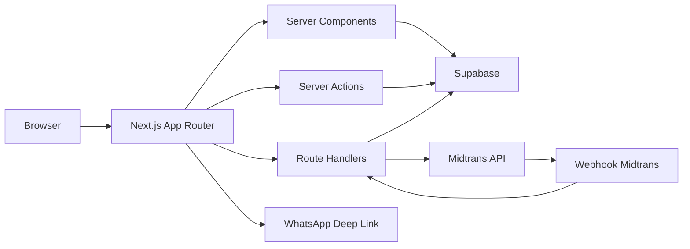
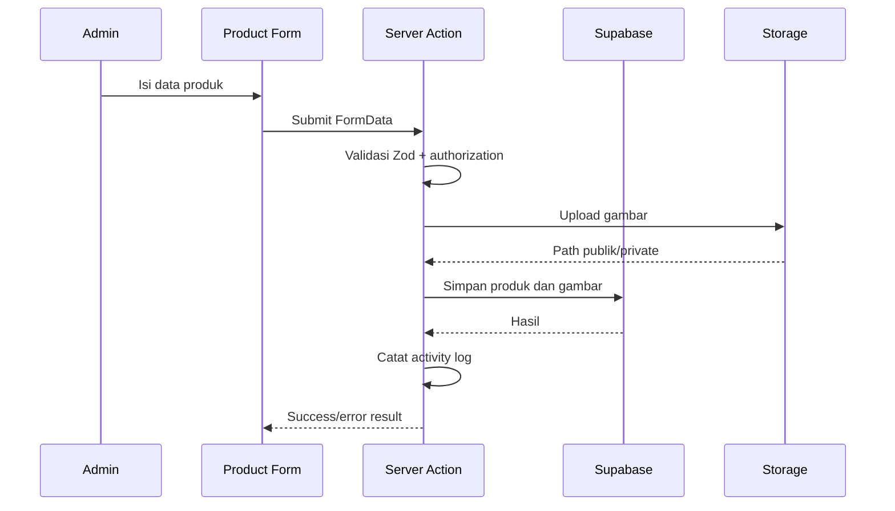
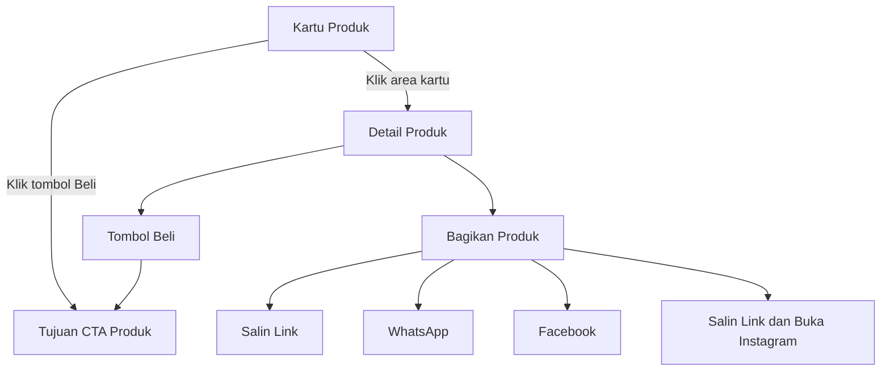
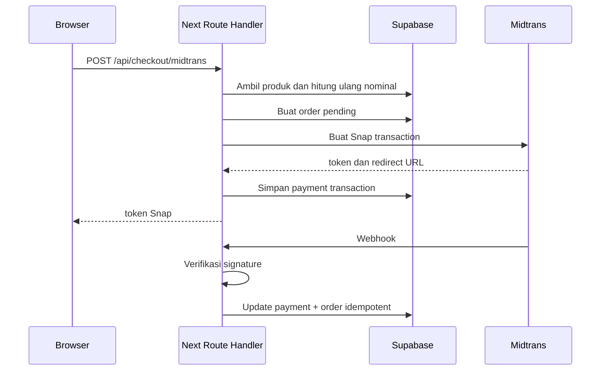

# Arsitektur Sistem

## 1. Gaya Arsitektur

Aplikasi menggunakan arsitektur modular berbasis Next.js App Router. Server Components menjadi default untuk rendering dan data fetching. Client Components digunakan hanya untuk interaksi browser, form interaktif, chart, dialog, atau state lokal.



## 2. Lapisan

### Presentation

- `src/app/`
- `src/components/`
- `src/app/_components/`

Tanggung jawab:

- Layout.
- Page.
- UI state.
- Form.
- Table.
- Chart.
- Accessibility.

### Application

- `src/actions/`
- `src/app/api/`
- domain services di `src/lib/`

Tanggung jawab:

- Use case.
- Validasi input.
- Authorization.
- Transaction orchestration.
- Revalidation.
- Integrasi eksternal.

### Domain

- `src/types/`
- `src/validations/`
- `src/constants/`

Tanggung jawab:

- Tipe domain.
- Enum dan status.
- Schema validasi.
- Aturan bisnis yang dapat diuji.

### Infrastructure

- `src/lib/supabase/`
- Midtrans client.
- Storage helper.
- Logger.
- Rate limiter.

Tanggung jawab:

- Database.
- Auth.
- Storage.
- Payment gateway.
- Observability.

## 3. Server dan Client Boundary

Gunakan Server Components untuk:

- Landing page.
- Katalog awal.
- Detail produk.
- Dashboard overview.
- Halaman daftar yang tidak membutuhkan interaksi real-time.

Gunakan Client Components untuk:

- Filter interaktif dengan state client.
- Keranjang.
- Dialog.
- Rich form.
- Grafik Recharts.
- Midtrans Snap client.
- Toast.

Data sensitif tidak boleh dipindahkan ke Client Component melalui props.

## 4. Aliran Data Produk



## 5. Aliran Interaksi Produk Publik



Tombol **Beli** di dalam kartu harus menghentikan event navigasi kartu agar langsung menuju CTA. Canonical URL produk digunakan untuk semua aksi berbagi.

## 6. Aliran Checkout Midtrans



## 7. Data Fetching

- Server-side read menggunakan Supabase server client.
- Client-side read yang memerlukan refresh interaktif menggunakan TanStack Query.
- Mutation dapat menggunakan Server Actions atau Route Handlers.
- Setelah mutation, gunakan `revalidatePath`, `revalidateTag`, atau invalidasi query.
- Jangan menyimpan server state utama di Zustand.

## 8. Error Handling

Gunakan bentuk hasil yang konsisten:

```ts
type ActionResult<T> =
  | { ok: true; data: T }
  | { ok: false; error: { code: string; message: string; fieldErrors?: Record<string, string[]> } };
```

Kategori error:

- `VALIDATION_ERROR`
- `UNAUTHORIZED`
- `FORBIDDEN`
- `NOT_FOUND`
- `CONFLICT`
- `RATE_LIMITED`
- `EXTERNAL_SERVICE_ERROR`
- `INTERNAL_ERROR`

Detail internal dicatat di server tetapi tidak dikirim ke pengguna.

## 9. Caching

- Cache katalog yang stabil dengan tag.
- Jangan cache data session atau halaman dashboard secara publik.
- Revalidate tag produk setelah perubahan produk.
- Revalidate tag kategori setelah perubahan kategori.
- Revalidate halaman dan tag pengaturan toko setelah admin mengubah profil website.
- Jangan cache respons webhook.

## 10. Observability

- Structured logging.
- Request/correlation ID.
- Error monitoring.
- Audit log database.
- Metric minimum: checkout created, payment success, payment failure, webhook rejected.
