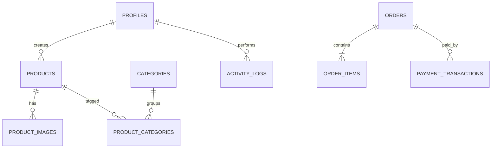

# Database Schema

## 1. Prinsip

- PostgreSQL melalui Supabase.
- UUID untuk primary key.
- `timestamptz` untuk waktu.
- Nilai uang disimpan sebagai integer satuan terkecil, misalnya rupiah penuh sebagai `bigint`.
- Soft delete digunakan untuk data yang perlu jejak audit.
- RLS aktif untuk tabel yang dapat diakses melalui Supabase API.
- Operasi administratif tetap memerlukan validasi server.

## 2. Enum

```sql
create type public.app_role as enum ('admin');
create type public.product_status as enum ('draft', 'active', 'inactive', 'archived');
create type public.cta_type as enum ('custom_url', 'whatsapp', 'midtrans');
create type public.order_status as enum (
  'pending', 'confirmed', 'processing', 'shipped', 'completed', 'cancelled'
);
create type public.payment_status as enum (
  'unpaid', 'pending', 'paid', 'failed', 'expired', 'refunded'
);
```

## 3. Tabel Inti

### `profiles`

| Kolom | Tipe | Catatan |
|---|---|---|
| id | uuid | FK ke `auth.users.id` |
| full_name | text | nullable |
| role | app_role | default `admin`; satu-satunya nilai yang diizinkan |
| is_active | boolean | default true |
| avatar_url | text | nullable |
| created_at | timestamptz | default now |
| updated_at | timestamptz | default now |

### `products`

| Kolom | Tipe | Catatan |
|---|---|---|
| id | uuid | PK |
| name | text | wajib |
| slug | text | unique |
| sku | text | unique |
| short_description | text | nullable |
| description | text | nullable |
| price | bigint | >= 0 |
| compare_at_price | bigint | nullable; bila diisi harus > `price` dan tampil sebagai harga coret |
| stock | integer | stok fisik/on hand; >= 0 |
| reserved_stock | integer | stok untuk order pending; default 0 |
| status | product_status | default draft |
| is_featured | boolean | default false |
| sort_order | integer | default 0 |
| seo_title | text | nullable |
| seo_description | text | nullable |
| cta_type | cta_type | wajib |
| cta_label | text | default Beli Sekarang |
| custom_url | text | nullable |
| whatsapp_number | text | nullable |
| whatsapp_template | text | nullable |
| open_in_new_tab | boolean | default false |
| midtrans_enabled | boolean | default false |
| created_by | uuid | FK profiles |
| updated_by | uuid | FK profiles |
| created_at | timestamptz | default now |
| updated_at | timestamptz | default now |
| deleted_at | timestamptz | nullable |

Constraint penting:

```sql
check (compare_at_price is null or compare_at_price > price);

check (reserved_stock >= 0 and reserved_stock <= stock);

check (
  (cta_type = 'custom_url' and custom_url is not null)
  or (cta_type = 'whatsapp')
  or (cta_type = 'midtrans' and midtrans_enabled = true)
)
```

### `product_images`

- `id uuid`
- `product_id uuid`
- `storage_path text`
- `public_url text nullable` (wajib diisi oleh alur upload baru setelah URL bucket berhasil diperoleh; nullable untuk kompatibilitas data lama)
- `alt_text text`
- `sort_order integer`
- `is_primary boolean`
- audit fields

Unique parsial disarankan agar hanya ada satu `is_primary = true` per produk.

### `categories`

- `id uuid`
- `parent_id uuid nullable`
- `name text`
- `slug text unique`
- `description text nullable`
- `image_path text nullable`
- `icon text nullable`
- `is_active boolean`
- `sort_order integer`
- audit fields
- `deleted_at timestamptz nullable`

### `product_categories`

- `product_id uuid`
- `category_id uuid`
- primary key gabungan `(product_id, category_id)`

### `orders`

- `id uuid`
- `order_number text unique`
- `customer_name text`
- `customer_email text nullable`
- `customer_phone text`
- `customer_address jsonb nullable`
- `status order_status`
- `payment_status payment_status`
- `payment_method text`
- `currency text default 'IDR'`
- `subtotal bigint`
- `discount_total bigint`
- `shipping_total bigint`
- `grand_total bigint`
- `notes text nullable`
- `idempotency_key uuid unique`
- `expires_at timestamptz`
- `reconciliation_required boolean default false`
- `created_at`
- `updated_at`
- `deleted_at nullable`

### `order_items`

Snapshot data harus disimpan agar perubahan produk tidak mengubah histori order.

- `id uuid`
- `order_id uuid`
- `product_id uuid nullable`
- `product_name text`
- `product_sku text nullable`
- `unit_price bigint`
- `quantity integer`
- `line_total bigint`
- `metadata jsonb`
- audit waktu

### `payment_transactions`

- `id uuid`
- `order_id uuid`
- `provider text default 'midtrans'`
- `provider_order_id text`
- `transaction_id text nullable`
- `transaction_status text nullable`
- `payment_type text nullable`
- `fraud_status text nullable`
- `gross_amount bigint`
- `currency text`
- `snap_token text nullable`
- `redirect_url text nullable`
- `raw_response jsonb nullable`
- `last_notification jsonb nullable`
- `paid_at timestamptz nullable`
- `expired_at timestamptz nullable`
- `created_at`
- `updated_at`

### Konten

- `banners`
- `testimonials`
- `faqs`

### `store_settings`

Gunakan satu record aktif sebagai sumber profil website yang dapat diedit admin dari dashboard.

| Kolom | Tipe | Catatan |
|---|---|---|
| id | uuid | PK |
| store_name | text | wajib |
| tagline | text | nullable |
| description | text | nullable |
| logo_path | text | nullable |
| favicon_path | text | nullable |
| contact_email | text | nullable |
| contact_phone | text | nullable |
| whatsapp_number | text | nullable |
| address | text | nullable |
| business_hours | jsonb | nullable |
| facebook_url | text | nullable, URL tervalidasi |
| instagram_url | text | nullable, URL tervalidasi |
| currency | text | default `IDR` |
| timezone | text | default `Asia/Jakarta` |
| flat_shipping_fee | bigint | default `0`; ongkir tetap MVP |
| low_stock_threshold | integer | default `5` |
| seo_title | text | nullable |
| seo_description | text | nullable |
| updated_by | uuid | FK profiles |
| created_at | timestamptz | default now |
| updated_at | timestamptz | default now |

### Audit

`activity_logs`:

- `id uuid`
- `actor_id uuid nullable`
- `action text`
- `entity_type text`
- `entity_id uuid nullable`
- `before_data jsonb nullable`
- `after_data jsonb nullable`
- `ip_address inet nullable`
- `user_agent text nullable`
- `created_at timestamptz`

## 4. Relasi



## 5. Index

```sql
create index products_public_catalog_idx
  on public.products (status, is_featured, sort_order, created_at desc)
  where deleted_at is null;

create index products_name_search_idx
  on public.products using gin (to_tsvector('simple', name || ' ' || coalesce(description, '')));

create index order_status_created_idx
  on public.orders (status, created_at desc);

create index order_reservation_expiry_idx
  on public.orders (expires_at)
  where status = 'pending';

create index payment_provider_order_idx
  on public.payment_transactions (provider, provider_order_id);
```

## 6. Trigger `updated_at`

```sql
create or replace function public.set_updated_at()
returns trigger
language plpgsql
as $$
begin
  new.updated_at = now();
  return new;
end;
$$;
```

Pasang trigger pada seluruh tabel yang memiliki `updated_at`.

## 7. RLS Ringkas

- Publik hanya dapat membaca produk aktif yang belum dihapus.
- Publik hanya dapat membaca kategori aktif.
- Publik hanya membaca field profil toko yang memang ditampilkan di website; konfigurasi sensitif tetap server-only.
- Hanya admin aktif yang dapat mengelola katalog, konten, profil toko, order, dan akun internal.
- Semua profil internal memiliki role `admin`; perubahan akses dilakukan melalui `is_active`, bukan mengganti role.
- Order publik dibuat melalui server, bukan insert langsung dari browser.
- Payment transaction hanya dapat diakses server/admin.
- Activity log tidak dapat diubah client.

Contoh:

```sql
create policy "public read active products"
on public.products
for select
using (status = 'active' and deleted_at is null);
```

## 8. Migrasi

Pisahkan migration menjadi:

```text
001_extensions.sql
002_enums.sql
003_functions.sql
004_profiles.sql
005_catalog.sql
006_orders.sql
007_content.sql
008_activity_logs.sql
009_indexes.sql
010_rls.sql
011_storage.sql
012_catalog_functions.sql
```
